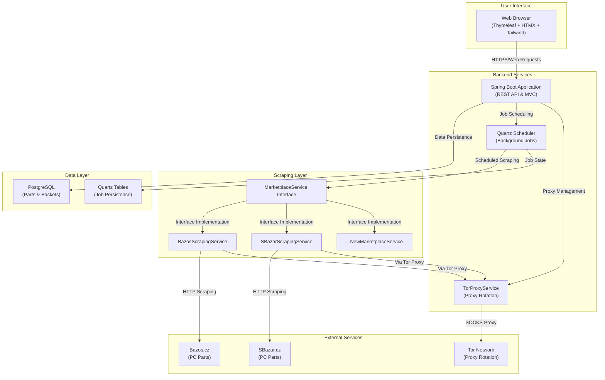

# PC Parts Scraper

A comprehensive Spring Boot web application for monitoring and aggregating PC parts listings from major Czech marketplaces, featuring automated scheduling, intelligent data deduplication, and Tor proxy support for enhanced scraping capabilities.

## Core Features

- 🖥️ **Multi-Marketplace Monitoring**: Tracks major Czech PC parts websites (Bazos.cz, SBazar.cz, and more)
- 📊 **Interactive Dashboard**: Modern web interface with real-time filtering and search capabilities
- 🔄 **Automated Scheduling**: Background scraping jobs with configurable intervals using Quartz Scheduler
- 🛡️ **Tor Proxy Support**: Built-in Tor proxy rotation to avoid rate limiting and IP blocking
- 📈 **Smart Deduplication**: Advanced algorithms to prevent duplicate entries and optimize storage
- 🗂️ **PC Build Baskets**: Create and manage custom PC build configurations
- 🎯 **Advanced Filtering**: Filter by part type, price range, marketplace, and search terms
- 📱 **Responsive Design**: Modern UI with dark mode support using Tailwind CSS + HTMX

## Technology Stack

[](https://openjdk.java.net/projects/jdk/24/)
[](https://spring.io/projects/spring-boot)
[](https://www.postgresql.org/)
[](http://www.quartz-scheduler.org/)
[](https://www.thymeleaf.org/)
[](https://htmx.org/)
[](https://tailwindcss.com/)
[](https://jsoup.org/)
[](https://www.torproject.org/)

## Architecture



## Quick Start

### Prerequisites

- **Java 24** or higher
- **Docker** and **Docker Compose**
- **Tor** (optional, for proxy features)

### Installation

1. **Clone the repository**
   ```bash
   git clone https://github.com/yourusername/pcpartsscraper.git
   cd pcpartsscraper
   ```

2. **Start the database**
   ```bash
   docker-compose up -d postgres
   ```

3. **Run the application**
   ```bash
   ./gradlew bootRun
   ```

4. **Access the application**
   - Web Interface: http://localhost:8080
   - API Documentation: http://localhost:8080/swagger-ui.html
   - Actuator Health: http://localhost:8080/actuator/health

### Docker Deployment

```bash
# Build and run with Docker Compose
docker-compose up --build

# Run in background
docker-compose up -d
```

## Configuration

### Database Configuration

The application uses PostgreSQL with optimized connection pooling:

```properties
# Database
spring.datasource.url=jdbc:postgresql://localhost:5432/pcpartsdb
spring.datasource.username=pcparts_user
spring.datasource.password=pcparts_password

# Connection Pool (HikariCP)
spring.datasource.hikari.maximum-pool-size=25
spring.datasource.hikari.minimum-idle=10
```

### Scraping Configuration

```properties
# Scraping Settings
app.scraping.enabled=true
app.scraping.bazos.interval-hours=3
app.scraping.bazos.max-concurrent-categories=5
app.scraping.bazos.duplicate-stop-threshold=0.8
```

### Tor Proxy Configuration

```properties
# Tor Proxy (Optional)
app.tor.enabled=false
app.tor.host=127.0.0.1
app.tor.socks-port=9050
app.tor.control-port=9051
app.tor.rotation-interval=10
```

## Features

### 🔍 Advanced Scraping Engine

- **Multi-threaded Processing**: Concurrent scraping of multiple categories
- **Intelligent Pagination**: Automatic page detection and traversal
- **Duplicate Prevention**: SHA-256 hash-based deduplication
- **Error Recovery**: Robust error handling with retry mechanisms
- **Rate Limiting**: Configurable delays to respect target sites

### 🛡️ Tor Proxy Integration

- **Automatic Proxy Rotation**: Rotate IP addresses every N requests
- **Circuit Management**: Request new Tor circuits for enhanced anonymity
- **Fallback Support**: Graceful fallback to direct connections
- **Configurable Settings**: Customizable proxy settings and rotation intervals

### 📊 Data Management

- **Comprehensive Part Data**: Title, description, price, location, seller info
- **Price Tracking**: Support for both fixed and negotiable pricing
- **Marketplace Attribution**: Track source marketplace and specific site
- **Temporal Data**: Scraping timestamps and update tracking

### 🎯 User Interface

- **Modern Design**: Clean, responsive interface with dark mode
- **Real-time Filtering**: HTMX-powered dynamic filtering without page reloads
- **Advanced Search**: Full-text search across titles and descriptions
- **Pagination**: Efficient pagination for large datasets
- **Part Categories**: Organized by CPU, GPU, RAM, Storage, and more

### 🗂️ PC Build Management

- **Build Baskets**: Create custom PC build configurations
- **Price Tracking**: Monitor total build costs
- **Part Management**: Add/remove parts from builds
- **Build History**: Track build modifications over time

## API Endpoints

### Web Interface
- `GET /` - Dashboard with statistics and recent parts
- `GET /parts` - Browse all parts with filtering
- `GET /baskets` - Manage PC build baskets

### Scraping API
- `GET /scraping/bazos` - Trigger full Bazos scraping
- `GET /scraping/bazos/{partType}` - Scrape specific category

### Monitoring
- `GET /actuator/health` - Application health status
- `GET /actuator/scheduledtasks` - View scheduled jobs
- `GET /actuator/quartz` - Quartz scheduler information

## Development

### Project Structure

```
src/main/java/com/tadeasfort/pcpartsscraper/
├── config/                 # Configuration classes
│   ├── QuartzConfig.java   # Quartz scheduler configuration
│   └── WebConfig.java      # Web MVC configuration
├── controller/             # REST controllers
│   ├── MainController.java # Main web interface
│   └── ScrapingController.java # Scraping API
├── model/                  # JPA entities
│   ├── Part.java          # PC part entity
│   ├── PCBasket.java      # Build basket entity
│   └── BasketItem.java    # Basket item entity
├── repository/             # Data access layer
│   └── PartRepository.java # Part repository
├── service/                # Business logic
│   ├── TorProxyService.java # Tor proxy management
│   └── scraping/          # Scraping services
│       ├── MarketplaceService.java # Service interface
│       ├── BazosScrapingService.java # Bazos implementation
│       ├── SBazar.java    # SBazar implementation
│       └── CategoryScrapingJob.java # Quartz job
└── PCPartsScraperApplication.java # Main application
```

### Adding New Marketplaces

1. **Create Service Class**
   ```java
   @Service
   public class NewMarketplaceService implements MarketplaceService {
       // Implement interface methods
   }
   ```

2. **Add Configuration**
   ```properties
   app.scraping.newmarketplace.enabled=true
   app.scraping.newmarketplace.interval-hours=4
   ```

3. **Update Quartz Jobs**
   - Add category mappings to QuartzConfig
   - Configure job scheduling parameters

### Testing

```bash
# Run all tests
./gradlew test

# Run with coverage
./gradlew test jacocoTestReport

# Integration tests
./gradlew integrationTest
```

## Deployment

### Production Configuration

1. **Environment Variables**
   ```bash
   export SPRING_PROFILES_ACTIVE=production
   export SPRING_DATASOURCE_URL=jdbc:postgresql://prod-db:5432/pcpartsdb
   export APP_TOR_ENABLED=true
   ```

2. **Docker Production**
   ```bash
   docker build -t pcpartsscraper:latest .
   docker run -d -p 8080:8080 pcpartsscraper:latest
   ```

3. **Tor Setup** (Optional)
   ```bash
   # Install Tor
   sudo apt-get install tor
   
   # Configure torrc
   echo "SocksPort 9050" >> /etc/tor/torrc
   echo "ControlPort 9051" >> /etc/tor/torrc
   
   # Start Tor
   sudo systemctl start tor
   ```

## Monitoring & Maintenance

### Health Checks
- Application health via Spring Actuator
- Database connection monitoring
- Quartz job execution tracking
- Tor proxy status monitoring

### Logging
- Structured logging with SLF4J + Logback
- Configurable log levels per package
- Scraping statistics and error reporting
- Performance metrics and timing data

### Maintenance Tasks
- Regular database cleanup of old parts
- Quartz job history maintenance
- Tor circuit rotation monitoring
- Performance optimization reviews

## Contributing

1. Fork the repository
2. Create a feature branch (`git checkout -b feature/amazing-feature`)
3. Commit your changes (`git commit -m 'Add amazing feature'`)
4. Push to the branch (`git push origin feature/amazing-feature`)
5. Open a Pull Request

## License

This project is licensed under the MIT License - see the [LICENSE](LICENSE) file for details.

## Support

- 📧 Email: business@tadeasfort.com
- 🐛 Issues: [GitHub Issues](https://github.com/yourusername/pcpartsscraper/issues)
- 📖 Documentation: [Wiki](https://github.com/yourusername/pcpartsscraper/wiki)

---

**Built with ❤️ for the PC building community** 
